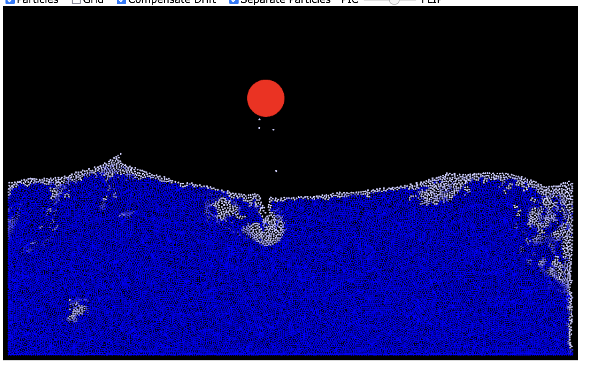
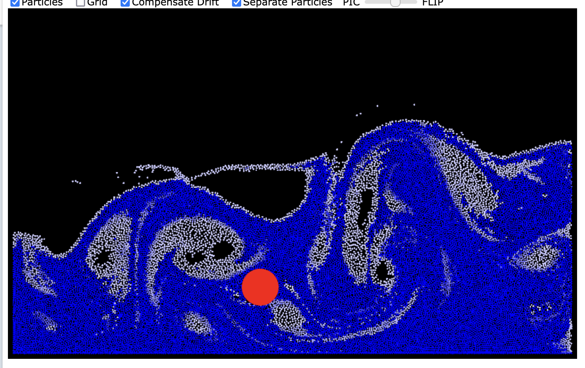
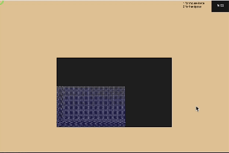
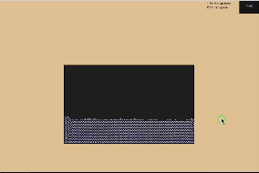

# CS91R-FinalProj

Code on Github
 Properly formatted and commented 
 
Write-up on Github (~1024 words of prose & pictures)
 Principles (why) 
 Design (what)
 Implementation (how)
 Evaluation (how well)
 
Presentation (Google Slides, Share with me)
 6-7 minutes (~6-9 slides)
 Demo would be great!
 
Cite any outside materials (e.g., libraries, tutorials)
 Where are they from, and how did you use/improve-upon them

Principles (why) 
Why is the problem important, and why are we confident it can be solved?
Design (what)
As designers, what choices and trade-offs are we making?
Implementation (how) 
As programmers, how will we realize our design?
Evaluation (how well)
As scientists, how do we decide how well the system works?

## Write-up: 

### Principles
For our project, we chose to recreate a fluid simulator entirely within p5.js. In general, fluid dynamics is a field with broad applications such as physics to computer graphics and visual arts. The reason why we chose to solve this problem was our passion for physics applications within graphics animations. Additionally, we felt confident in both our knowledge of p5.js and our math backgrounds, and by referencing a an existing fluid sim tutorial, we could follow the  steps needed to implement it within p5.js. (https://www.youtube.com/watch?v=XmzBREkK8kY&feature=youtu.be)

 

### Design
In terms of design, we already had a good idea of what our FLIP (Fluid-Implicit Particles) water simulator would look like, based on existing ones. Similarly for our fluid sim, we drew small fluid particles (ellipses) within a box representing the tank containing the fluid, and these particles would be animated within draw().  In our backend, the water tank is divided into a grid (a 2D array) where each cell is used for velocity calculations. This meant we had to ensure the grid's parameters were boundaries representing the ends of the box, where our fluid would know it couldn't flow into a solid object so we made flags representing 0 = wall and 1 = fluid. Ultimately, this was all the design needed as the rest would be the fluid logic happening behind the scenes, but in terms of further interraction, an idea we included was allowing the mouse to splash the water around by giving it a "forcefield", as if it were a solid object inside the tank allowing the user to make their own waves.

 

In this example FLIP simulator, the black box represents the tank storing the water, and the red ball is the object used to splash the water around. Without the ball's interration, the water's natural behavior is to generate small waves at the surface. The blue particles indicate higher density/lower velocity, and white indicates lower density/higher velocity.

 

 

After using the ball to splash the water around the tank, we observe large waves as the fluid crashes against itself and the walls. Due to the increased velocity, we see more white particles.

 
 

### Implementation
Our project is a recreation of a FLIP water simulator - a type of fluid sim that represents the fluid as particles, and to calculate fluid-like motion, every frame run through 4 steps: We map the particle velocities onto a grid, run the velocity calculations via a projection step, copy the new velocities back onto the particles, and then simulate the result (update density + check for collisions). 
Within this projection step is where most of the movement logic takes place: After converting dividing particle velocity into cells on a grid, we then calculate the cells' velocities to be incompressible (which is a property of fluid dynamics that measures volume change as a response to a pressure).

We began our process of implementation by first making a top-down-design, where within draw() we represented the 4 main steps of our simulation as functions that were constructed later on. In the coding process, we first ensured that our particles were visible and obeying normal gravity, to which we then started implementing the steps one by one.

 

Our fluid simulator (this is the fluid's normal behavior of assuming the shape of its container.)

 

Our interraction features. Here, the mouse controls a circle acting as a solid. In handpose mode, ml5.handpose will detect your index finger to be the mouse!

 

### Evaluation
We can base our evaluation based on the working FLIP simulators that exist (most of which don't use p5.js), and how well ours compares to theirs. In terms of the general physics, while we obey general newtonian physics and have some fluid-like properties (some swirling/ waves) it isn't a perfect fluid sim. In implementing the 4-step FLIP logic, we ran into  p5.js specific problems/ malfunctionings (the inverted y axis, weird compiler issues) toward the end, and most of our time was spent searching for these bugs and making smaller adjustments. Other than that, our framerate seems to be operating as well as p5 can handle. Additionally, we implemented mouse interration where moving the cursor can splash water around, and we also included ml5's handpose library so when handpose mode is selected, a hand can instead serve as the mouse to then move the water around.
